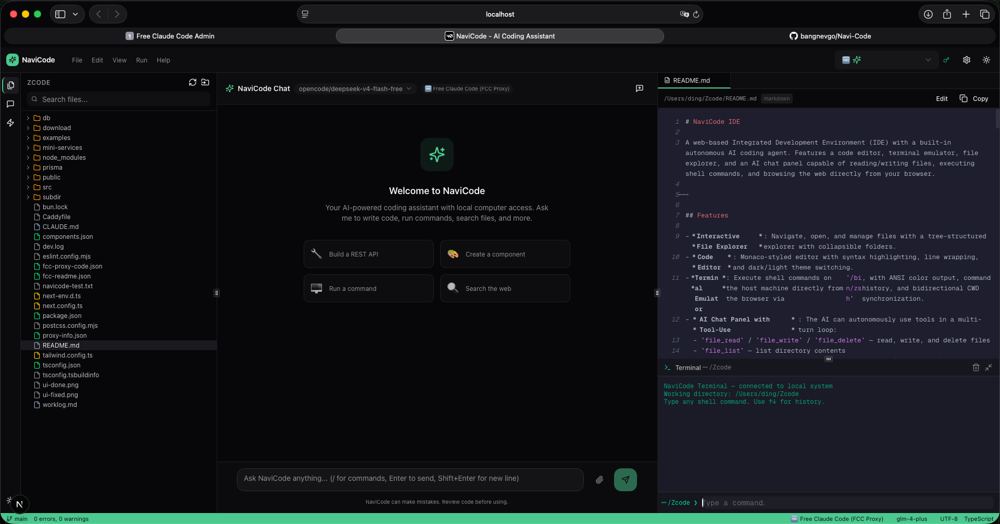

# NaviCode IDE



A web-based Integrated Development Environment (IDE) with a built-in autonomous AI coding agent. Features a code editor, terminal emulator, file explorer, and an AI chat panel capable of reading/writing files, executing shell commands, and browsing the web directly from your browser.

---

## Features

- **Interactive File Explorer**: Navigate, open, and manage files with a tree-structured explorer with collapsible folders.
- **Code Editor**: Monaco-styled editor with syntax highlighting, line wrapping, and dark/light theme switching.
- **Terminal Emulator**: Execute shell commands on the host machine directly from the browser via `/bin/zsh`, with ANSI color output, command history, and bidirectional CWD synchronization.
- **AI Chat Panel with Tool-Use**: The AI can autonomously use tools in a multi-turn loop:
  - `file_read` / `file_write` / `file_delete` — read, write, and delete files
  - `file_list` — list directory contents
  - `file_search` — search files by name and content (grep + find)
  - `terminal_exec` — run shell commands
  - `web_search` / `web_scrape` — search and scrape web pages
  - `system_info` — get system information
  - `ask_question` — present interactive choice overlays to the user
  - `start_subagent` — spawn background subagents for parallel tasks
- **Slash Commands**: Quick AI workflows via `/commit`, `/review`, `/bug`, `/test`, `/explain`, `/search`, `/vuln`, `/doctor`
- **Multi-Provider AI**: Supports OpenAI-compatible, Anthropic-compatible, and built-in (ZAI) providers. Includes Free Claude Code (FCC) proxy support with Claude extended thinking.
- **Skills Panel**: Enable/disable agent skills to customize the AI's capabilities.
- **Resizable Panels**: All panels are resizable and draggable via `react-resizable-panels`.
- **Chat History**: Persistent conversations stored in SQLite, with conversation management.
- **Settings Dialog**: Configure AI providers, API keys, and model selection through a UI.
- **Theme Toggle**: Dark and light mode with persistent state.
- **Status Bar**: Shows git branch, AI provider/model, encoding, and language info.

## Tech Stack

| Layer              | Technology                                                  |
| ------------------ | ----------------------------------------------------------- |
| Framework          | [Next.js 16](https://nextjs.org/) (App Router, Turbopack)   |
| UI Components       | [React 19](https://react.dev/), [Tailwind CSS v4](https://tailwindcss.com/), [Shadcn UI](https://ui.shadcn.com/), [Radix Primitives](https://www.radix-ui.com/) |
| State Management   | [Zustand](https://github.com/pmndrs/zustand)                |
| Database & ORM     | [Prisma](https://www.prisma.io/) + SQLite                   |
| Terminal           | xterm.js (custom panel implementation)                      |
| Layout             | [react-resizable-panels](https://github.com/bvaughn/react-resizable-panels) |
| Code Rendering     | [react-syntax-highlighter](https://github.com/react-syntax-highlighter/react-syntax-highlighter), [react-markdown](https://github.com/remarkjs/react-markdown) |
| Animations         | [Framer Motion](https://www.framer.com/motion/)             |
| Forms              | [react-hook-form](https://react-hook-form.com/) + [Zod](https://zod.dev/) |
| Tables & Charts    | [TanStack Table](https://tanstack.com/table), [Recharts](https://recharts.org/) |

## Getting Started

### Prerequisites

- [Node.js](https://nodejs.org/) v18+ or [Bun](https://bun.sh/)

### Setup

```bash
# Copy environment variables
cp .env.example .env
```

Edit `.env`:
```env
DATABASE_URL="file:../db/custom.db"
NAVICODE_ROOT="/path/to/your/workspace"
```

### Initialize Database

```bash
bun x prisma generate
bun x prisma db push
```

### Run

```bash
bun run dev
```

Open [http://localhost:3000](http://localhost:3000) in your browser.

## Project Structure

```
src/
├── app/
│   ├── page.tsx              # Main IDE page
│   ├── layout.tsx            # Root layout
│   ├── globals.css           # Global styles
│   └── api/
│       ├── chat/route.ts     # AI chat with multi-provider support
│       ├── editor/cwd/route.ts
│       ├── fs/route.ts       # Filesystem API
│       ├── models/route.ts   # AI model listing
│       ├── system/route.ts   # System information
│       ├── terminal/route.ts # Shell execution with safety checks
│       ├── tools/route.ts    # AI tool execution hub
│       └── web/route.ts      # Web fetch proxy
├── components/
│   ├── chat/                 # ChatPanel, ChatInput, ChatMessage
│   ├── editor/               # CodeEditor (Monaco-styled)
│   ├── file-explorer/        # FileExplorer
│   ├── layout/               # IDELayout (main IDE shell with menus, panels)
│   ├── settings/             # SettingsDialog (provider config)
│   ├── skills/               # SkillsPanel
│   ├── terminal/             # TerminalPanel (xterm.js-like)
│   └── ui/                   # Shadcn UI components (~40 components)
├── stores/                   # Zustand stores
│   ├── chat-store.ts         # Conversations, messages, model selection
│   ├── editor-store.ts       # Open files, active file, terminal state
│   ├── file-store.ts         # File explorer root path
│   ├── provider-store.ts     # AI provider configurations
│   └── skill-store.ts        # Skills system
├── hooks/                    # Custom hooks (use-mobile, use-toast)
└── lib/                      # Utilities (utils, db)
prisma/
└── schema.prisma             # SQLite schema (User, Post models)
```

## AI Tool Protocol

The AI agent communicates with tools by emitting JSON blocks inside ` ```tool ``` ` fenced blocks:

````
```tool
{"tool": "terminal_exec", "input": {"command": "git diff HEAD~1", "cwd": "/project"}}
```
````

The frontend parses this, executes the tool via the API, and returns the result to the AI for the next turn.

### Available Tools

| Tool              | Description                              |
| ----------------- | ---------------------------------------- |
| `file_read`       | Read a file's contents                   |
| `file_write`      | Create or overwrite a file               |
| `file_list`       | List directory contents                  |
| `file_delete`     | Delete a file                            |
| `file_search`     | Search files by name or content (grep)   |
| `terminal_exec`   | Run a shell command                      |
| `web_search`      | Search the web                           |
| `web_scrape`      | Scrape a web page                        |
| `system_info`     | Get OS, CPU, memory, Node.js info        |
| `ask_question`    | Ask the user a question with options     |
| `start_subagent`  | Spawn a background subagent              |

### Supported AI Providers

- **OpenAI-compatible** (OpenAI, OpenRouter, any `/chat/completions` API)
- **Anthropic-compatible** (Anthropic, Free Claude Code proxy, Fireworks, Moonshot)
- **Built-in** (ZAI SDK — Zhipu GLM models, no API key needed)

## Architecture Notes

- All interactive components use `'use client'`
- Layout uses `ResizablePanelGroup` for all panel splitting (sidebar, chat, editor, terminal)
- Custom DOM events: `navicode-open-folder`, `navicode-saved`, `navicode-run-command`, `navicode-send`
- Terminal `cd` is handled client-side with CWD tracking; all other commands execute via `/api/terminal`
- Filesystem paths are sanitized via `resolve()` + `safePath()` — no symlink escapes outside allowed root
- Terminal safety blocks destructive commands (`rm -rf /`, `mkfs`, `shutdown`, etc.)

## Run for Free with Free Claude Code (FCC) Proxy

NaviCode has **built-in support** for [Free Claude Code (FCC)](https://github.com/Alishahryar1/free-claude-code) — a free, open-source proxy that routes requests to Claude models (Opus, Sonnet, Haiku) through community-provided API endpoints. No paid API key required.

### Install FCC Proxy

```bash
curl -fsSL "https://github.com/Alishahryar1/free-claude-code/blob/main/scripts/install.sh?raw=1" | sh
```

Then start the proxy:

```bash
fcc-server
```

The FCC proxy runs at `http://localhost:8082`.

### Configure in NavicCode

1. Open NaviCode at `http://localhost:3000`
2. Click the **Settings** icon (gear) in the top bar
3. Add a new **Anthropic-compatible** provider with:
   - **Name**: `FCC Proxy` (or anything containing "fcc")
   - **Base URL**: `http://localhost:8082`
   - **API Key**: `freecc` (default, or your `ANTHROPIC_AUTH_TOKEN`)
4. Save and select the FCC provider from the model dropdown
5. Choose a Claude model (e.g. `claude-sonnet-4-6`, `claude-3-opus`, `claude-3-haiku`)

### How It Works

NaviCode detects FCC proxy automatically by recognizing "fcc" in the provider name or `:8082` in the base URL. When detected:
- Uses Anthropic Messages API format for requests
- Enables **Claude extended thinking** (budget: 10K tokens)
- Provides helpful error messages for common FCC issues (auth, model availability, rate limits)
- Falls back gracefully with connection troubleshooting tips

You can verify available models by opening `http://localhost:8082/admin` in your browser — the admin UI shows which models are accessible and lets you configure provider API keys if needed.

> **Note**: Some models via FCC proxy may require additional upstream API keys configured in the proxy admin panel (`http://localhost:8082/admin`). Free models work out of the box.

## Comparison: NaviCode vs OpenCode vs Codex CLI

NaviCode is one of several AI-powered coding tools. Here's how it compares with the most popular alternatives:

| Aspect | NaviCode | [OpenCode](https://opencode.ai/) | [Codex CLI](https://developers.openai.com/codex/cli) |
|--------|----------|----------------------------------|-------------------------------------------------------|
| **Interface** | Web IDE (visual editor + file explorer + terminal) | TUI / CLI / Web / IDE extension | CLI / TUI |
| **AI Protocol** | Text-based tool JSON blocks | Native agent | Native agent (Rust) |
| **AI Providers** | OpenAI, Anthropic, built-in (ZAI), FCC proxy | Provider-agnostic (any LLM) | OpenAI only (GPT) |
| **Subagent** | ✅ | ❌ | ✅ |
| **MCP Support** | ❌ | ✅ | ✅ |
| **Visual Editor** | ✅ Full Monaco-styled editor | ❌ | ❌ |
| **Plan / Build Modes** | ❌ | ✅ | ❌ |
| **Terminal** | ✅ Web-based with CWD sync | ✅ Native terminal | ✅ Native terminal |

**When to use each:**

- **NaviCode** — Best if you want a **full IDE experience in the browser** with a built-in AI agent that can read, write, and execute code autonomously.
- **OpenCode** — Best if you want a **flexible terminal-first AI agent** that works with any LLM provider, supports MCP/LSP, and has plan-vs-build separation.
- **Codex CLI** — Best if you're **already in the OpenAI ecosystem** and want a high-performance Rust-based agent with subagents, image generation, and cloud task support.

## Security Warning for Production (Cloud Deployments)

> NaviCode includes terminal execution (`api/terminal`) and filesystem tools (`api/fs`) that allow the system to read/write files and execute arbitrary command lines on the host environment.
>
> If you deploy NaviCode to a public production cloud environment (e.g., SaaS), **you must isolate the terminal execution environment** inside secure, sandboxed containers (Docker, Fly.io micro-VMs, or gVisor) to prevent malicious actors from gaining root access to the host server.

## License

imagents-ai.com
